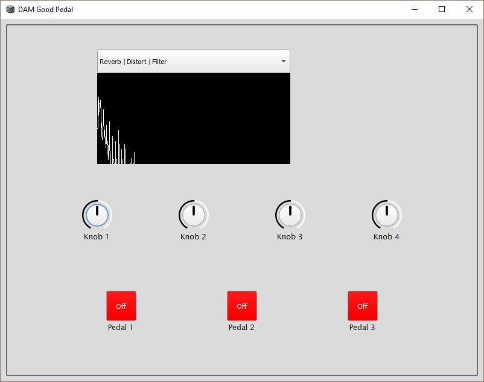

# DAM GUI
The DAM GUI is a virtual implementation of the DAM Good Pedal.

## Installation Instructions

  ### Windows and Mac
  - Install SuperCollider from https://supercollider.github.io/download
  - Launch SuperCollider to initialize the `extensions` directory
  - In a shell, use the command `python3 setup-resources.py` to install the `DAM-GUI` and `DAMPedalController` classes.
  - Either restart SuperCollider or use the keystroke `Ctrl-Shift-L` to compile the new classes.

  
  ### Linux
  - Make sure to copy `DAM-GUI.sc` and `DAMPedalController.sc` to your supercollider extensions file.
    - To find the location of this file, you can use `Platform.userExtensionDir` or `Platform.systemExtensionDir` in supercollider.
  - Once that is added to your extension folder, use the keystroke `ctrl-shift-l` in supercollider to recompile the class library.


## How to Run
  - Open gui.scd with SuperCollider. Run the file:
  -   With cursor in text editor use keystroke `Ctrl-Enter`
  -   OR select `Language->Evaluate File`
  - On Linux, use the command: ```sclang -u 57120 gui.scd``` to run the program


## How To Use
  - Once running the following window should appear, and audio should be playing. 
    - If you do not see this window or hear any audio, verify that you have followed all instructions above.
  - The menu, knobs and buttons can be clicked\dragged to modify the currently active effects.
## Keybinds
  **Key stroke** | **Behavior** 
  --- | ---
  **[1\|2\|3]** | toggle footswitch 1, 2, or 3 on and off.
  **ctrl-[1\|2\|3]** | force footswitch off.
  **shift-[1\|2\|3]** | toggles *hold on* on footswitch, use **[1\|2\|3]** or **ctrl-[1\|2\|3]** to turn hold off.
  **a** | Decreases knob 1.
  **s** | Increases knob 1.
  **d** | Decreases knob 2.
  **f** | Increases knob 2.
  **g** | Decreases knob 3.
  **h** | Increases knob 3.
  **j** | Decreases knob 4.
  **k** | Increases knob 4.
  **shift-[a\|s\|d\|f\|g\|h\|j\|k]** | Quickly modify knob.
  **ctrl-[a\|s\|d\|f\|g\|h\|j\|k]** | Slowly modify knob.
  **,** | Navigate menu left.
  **.** | Navigate menu right.

## Scenes
  ### Reverb \| Distort \| Filter
   - **Knob 1** - Reverb Mix
   - **Knob 2** - Reverb Room
   - **Knob 3** - Distortion Factor
   - **Knob 4** - Low Pass Filter Cutoff
   ### Looper
   - **Pedal 1 Hold** - Record
   - **Pedal 1 Tap(on)** - Playback Recording
   ### Phaser \| Chorus \| Delay
   - **Knob 1** - Phaser Frequency
   - **Knob 2** - Phaser Delay
   - **Knob 3** - Delay Delay Time
   - **Knob 4** - Delay Decay Time
   ### Compressor
   - **Knob 1** - Compressor Gain
   - **Knob 2** - Compressor Threshold

   
